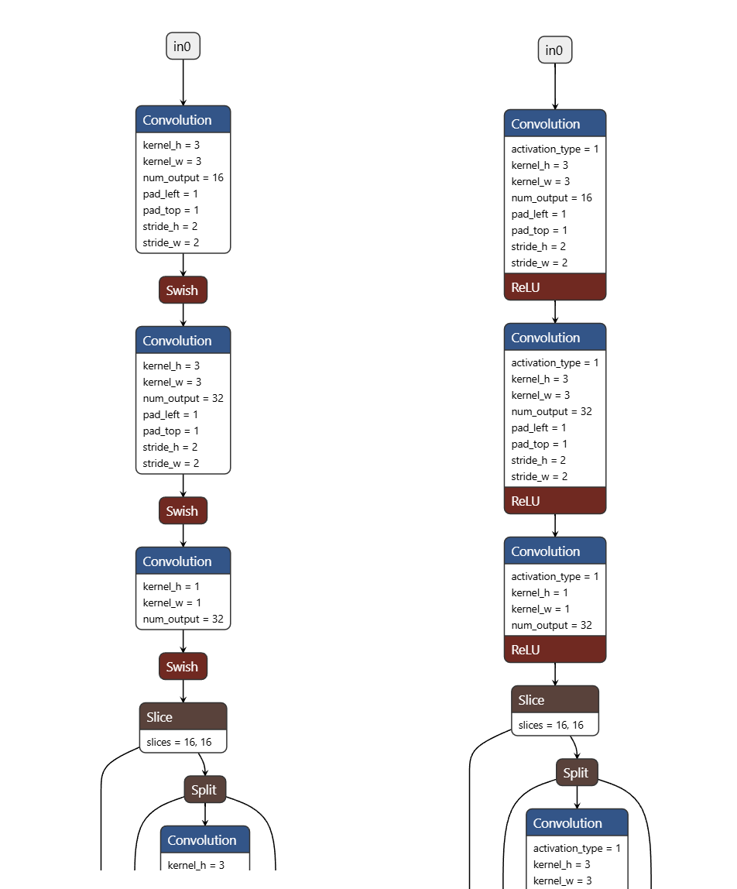

# 一、起因

别的同事说起，把激活函数换成ReLU，而不是的某种xxLU，可以变快很多（1/4量级），且表现不会下降很多，所以我试一试。

# 二、确认SiLUvsReLU的1000epoch结果

完全相同的训练参数和随机种子

## 结构1：yolo11-pose的官方结构

训练结果文件夹：160x1000epoch_MileStone

最终Loss：box 0.614

训练集结果：TP 46182, FN 55, FP 85

## 结构2：yolo11-pose的官方结构，替代默认激活函数SiLU为ReLU

训练结果文件夹：160x1000epoch_Relu

最终Loss：box 0.665

训练集结果：TP 46172, FN 65, FP 162

## 对比两者结构图，确认结构正确

确实完全一致，只有激活函数不同

# 三、对比两者速度

49 vs 47  (UT，无线程争抢)

54 vs 50（UT，打开camera预览但关闭人类检测，造成线程争抢）
